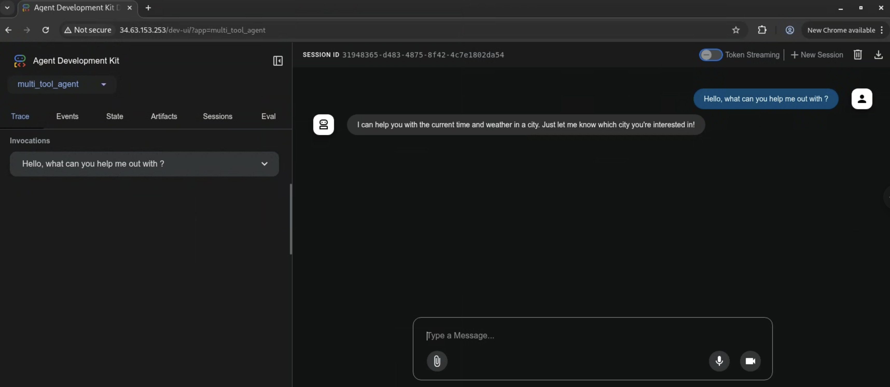

# Deploying Agents to Google Kubernetes Engine (GKE)

You can deploy your ADK-built agents directly to a running Google Kubernetes Engine (GKE) cluster. This allows you to leverage the scalability, portability, and management features of Kubernetes for your production agent workloads.

The `adk deploy gke` command abstracts away the complexity of containerizing your agent, generating Kubernetes manifests, and applying them to your cluster.

### Prerequisites

Before you begin, ensure you have the following set up:

1. **A running GKE cluster:** You need an active Kubernetes cluster on Google Cloud.

2. **`gcloud` CLI:** The Google Cloud CLI must be installed, authenticated, and configured to use your target project. Run `gcloud auth login` and `gcloud config set project [YOUR_PROJECT_ID]`.

3. **Required IAM Permissions:** The user or service account running the command needs, at a minimum, the following roles:

   * **Kubernetes Engine Developer** (`roles/container.developer`): To interact with the GKE cluster.

   * **Artifact Registry Writer** (`roles/artifactregistry.writer`): To push the agent's container image.

4. **Docker:** The Docker daemon must be running on your local machine to build the container image.

### The `deploy gke` Command

The command takes the path to your agent and parameters specifying the target GKE cluster.

#### Syntax

```bash
adk deploy gke [OPTIONS] AGENT_PATH
```

### Arguments & Options

| Argument    | Description | Required |
| -------- | ------- | ------  |
| AGENT_PATH  | The local file path to your agent's root directory.    |Yes |
| --project | The Google Cloud Project ID where your GKE cluster is located.     | Yes | 
| --cluster_name   | The name of your GKE cluster.    | Yes |
| --region    | The Google Cloud region of your cluster (e.g., us-central1).    | Yes |
| --with_ui   | Deploys both the agent's back-end API and a companion front-end user interface.    | No |
| --verbosity   | Sets the logging level for the deployment process. Options: debug, info, warning, error.     | No |

### How It Works
When you run the `adk deploy gke` command, the ADK performs the following steps automatically:

- Containerization: It builds a Docker container image from your agent's source code.

- Image Push: It tags the container image and pushes it to your project's Artifact Registry.

- Manifest Generation: It dynamically generates the necessary Kubernetes manifest files (a `Deployment` and a `Service`).

- Cluster Deployment: It applies these manifests to your specified GKE cluster, which triggers the following:

The `Deployment` instructs GKE to pull the container image from Artifact Registry and run it in one or more Pods.

The `Service` creates a stable network endpoint for your agent. By default, this is a LoadBalancer service, which provisions a public IP address to expose your agent to the internet.


### Example Usage
Here is a practical example of deploying an agent located at `~/agents/multi_tool_agent/` to a GKE cluster named test.

```bash
adk deploy gke \
    --project myproject \
    --cluster_name test \
    --region us-central1 \
    --with_ui \
    --verbosity info \
    ~/agents/multi_tool_agent/
```


### Verifying Your Deployment
After the command completes successfully, you can verify the deployment using kubectl.

1. Check the Pods: Ensure your agent's pods are in the Running state.

```bash
kubectl get pods
```
You should see output like `adk-default-service-name-xxxx-xxxx ... 1/1 Running` in the default namespace.

2. Find the External IP: Get the public IP address for your agent's service.

```bash
kubectl get service
NAME                       TYPE           CLUSTER-IP      EXTERNAL-IP     PORT(S)        AGE
adk-default-service-name   LoadBalancer   34.118.228.70   34.63.153.253   80:32581/TCP   5d20h
```

We can navigate to the external IP and interact with the agent via UI

